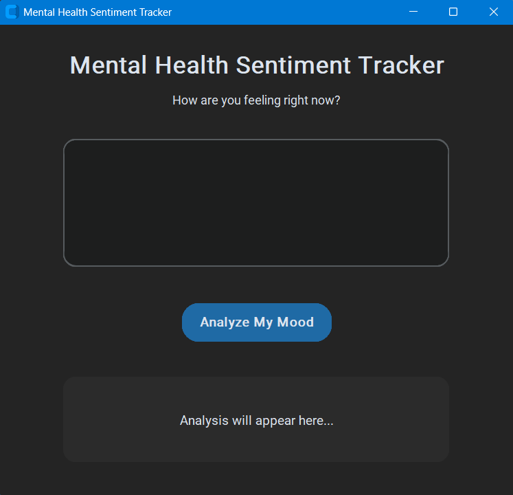
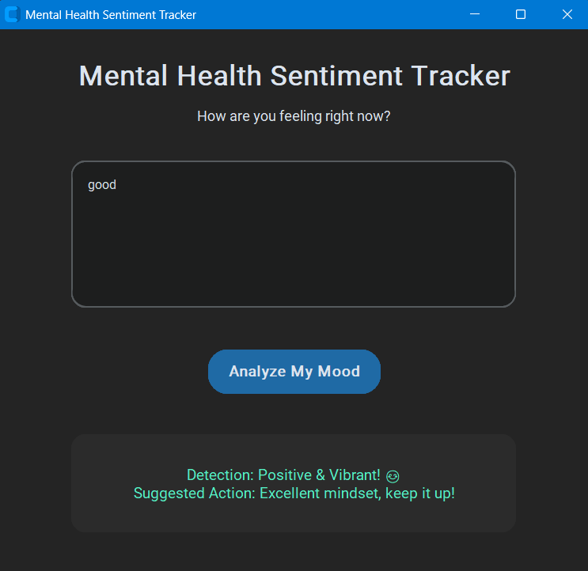
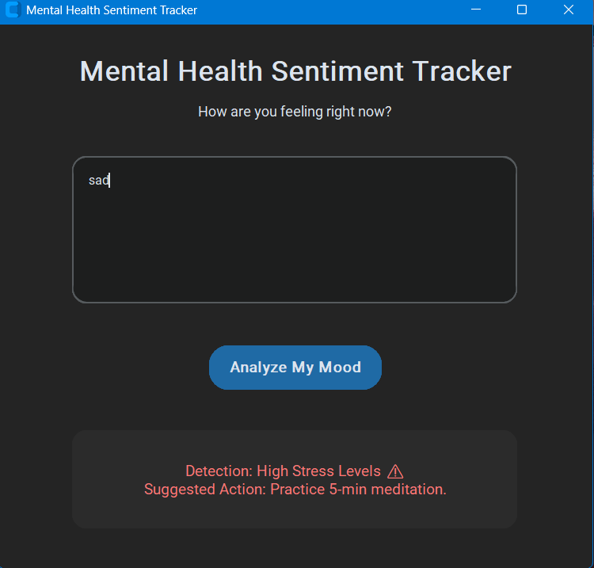

# Mental Health Sentiment Tracker 🧠💻

A proactive mental health monitoring application built with **Python** and **Natural Language Processing (NLP)**. This tool is designed to analyze text-based emotional cues and provide immediate feedback on the user's mental well-being.

## 🌟 Overview
In the current fast-paced academic and professional environment, mental health often takes a backseat. **MindTrack AI** serves as a digital companion that detects early signs of stress, anxiety, or negativity through sentiment analysis, promoting early emotional awareness.

## 🖥️ App Interface

### 1. Main Dashboard
The initial landing state of the application.
 

### 2. Positive Mood Detection
The interface turns green when positive sentiments are detected.
 

### 3. Stress Detection
The interface flags negative sentiments in red with helpful advice.
 

## 🚀 Key Features
- **Real-time Sentiment Analysis:** Leverages NLP algorithms to categorize emotional states as Positive, Neutral, or Stressed.
- **Modern User Interface:** A highly polished and responsive GUI built with `CustomTkinter` for a premium user experience.
- **Proactive Feedback:** Provides tailored suggestions and mindfulness tips based on the detected emotional intensity.
- **Privacy-Focused:** All data is processed locally on the user's machine.

## 🛠️ Tech Stack
- **Language:** Python 3.x
- **NLP Engine:** TextBlob / NLTK
- **GUI Framework:** CustomTkinter
- **Data Handling:** Pandas / NumPy

## 📂 Project Structure
- `app.py`: Main executable file containing both logic and GUI.
- `requirements.txt`: Project dependencies and libraries.

## 📈 Roadmap (Upcoming Features)
- **Acoustic Analysis:** Integrating `Librosa` for voice-based emotion detection.
- **Analytics Dashboard:** Visualizing mood patterns over time using Matplotlib.
- **Export Reports:** Option to download analysis history in PDF/CSV format.

---
*Developed by Harish Nirmalkar*
